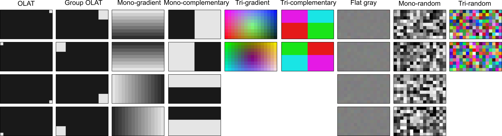
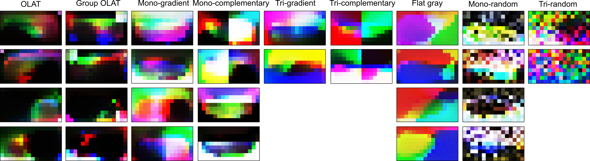

<div align="center">
<h1>A Real-world Display Inverse Rendering Dataset<br>(ICCV 2025)</h1>

<a href="https://michaelcsj.github.io/DIR/"></a> <!-- <a href="https://arxiv.org/pdf/2506.18882"></a> --> <a href="https://huggingface.co/datasets/SeokjunChoi/display-inverse-rendering-dataset"></a>

[Seokjun Choi](https://michaelcsj.github.io/), [Hoon-Gyu Chung](https://sites.google.com/view/hoongyu-chung/home), [Yujin Jeon](), [Giljoo Nam](https://sites.google.com/view/gjnam), [Seung-Hwan Baek](https://www.shbaek.com/)


</div>

<!-- <p align="center">
  
</p> -->

**Conference:** IEEE/CVF International Conference on Computer Vision (ICCV), 2025

# 📊 Overview

`DIR dataset` is a dataset for `Display Inverse Rendering (DIR)`. It contains assets captured from LCD & polarization-camera system.
* **OLAT Images:** are capured under display superpixels, and can be used to simulate arbitrary display patterns.
* **GT Geometry:** is scanned with a high-precision 3D scanner.
* **Lighting information:** We carefully calibrated light direction, non-linearity, and backlight.
* **Stereo Imaging:** is an optional feature to initialize rough geometry.

**Why Display Inverse Rendering?**
Display inverse rendering uses a monitor as a per-pixel, programmable light source to reconstruct object geometry and reflectance from captured images. Key features include:
* **Illumination Multiplexing:** encodes multiple lights and reduces demanded a number of inputs.
* **Leveraging Polarization:** enables diffuse-specular separation based on optics.

<!-- **Abstract:**
**Display inverse rendering** uses a monitor as a per-pixel, programmable light source—often leveraging LCD polarization—to reconstruct object geometry and reflectance from captured images. We address the lack of real-world data by releasing the first display-camera dataset for this task. An LCD + stereo polarization cameras capture diverse objects under one-light-at-a-time (OLAT) patterns, with accurate ground-truth geometry. The dataset supports simulation under arbitrary display patterns, enables benchmarking of photometric stereo and inverse rendering methods, and includes a simple baseline that outperfoms state-of-the-art methods. -->

<!-- Inverse rendering aims to reconstruct geometry and reflectance from captured images. Display-camera imaging systems offer unique advantages for this task: each pixel can easily function as a programmable point light source, and the polarized light emitted by LCD displays facilitates diffuse-specular separation. Despite these benefits, there is currently no public real-world dataset captured using display-camera systems, unlike other setups such as light stages. This absence hinders the development and evaluation of display-based inverse rendering methods. In this paper, we introduce the first real-world dataset for display-based inverse rendering. To achieve this, we construct and calibrate an imaging system comprising an LCD display and stereo polarization cameras. We then capture a diverse set of objects with diverse geometry and reflectance under one-light-at-a-time (OLAT) display patterns. We also provide high-quality ground-truth geometry. Our dataset enables the synthesis of captured images under arbitrary display patterns and different noise levels. Using this dataset, we evaluate the performance of existing photometric stereo and inverse rendering methods, and provide a simple, yet effective baseline for display inverse rendering, outperforming state-of-the-art inverse rendering methods. -->

# 📝 TODO List
- [x] ~~Release a baseline code.~~
- [x] ~~Release `Display Inverse Rendering (DIR)` dataset.~~
- [ ] Release EXPANDED version of DIR datset (HDR).
- [ ] Release EXPANDED version of DIR datset (multi-distance).
- [ ] Release additional visualization tools.
- [ ] Release raw image processing code.

<!-- ## 🚀 Steps to Get Started
### Step 1: Install Dependencies -->
# 🚀 Get Started 
### 💾 Installation

```bash
git clone https://github.com/MichaelCSJ/DIR.git
cd DIR
conda env create -f environment.yml
conda activate DIR
```

### 📝 Dataset Preparation
Download the [DIR dataset](https://huggingface.co/datasets/SeokjunChoi/display-inverse-rendering-dataset) for perform our display inverse rendering baseline. It consists of 16 real-world objects with diverse shapes and materials under precisely calibrated directional lighting. There are some versions of dataset as **'DIR-basic'**, **'DIR-pms'**, **'DIR-hdr'**, and **'DIR-multi-distance'**.
* **DIR-basic**: The basic version of the dataset released with the paper. It includes stereo polarized RAW images, RGB images from a reference view, and ground-truth surface normals and point clouds. All images are captured under a multi-light configuration projected through 16×9 superpixels on the display.
```
  ├── A
  │  ├──GT_geometry (for reference(main) view)
  │  │  ├──'normal.npy',
  │  │  ├──'normal.png',
  │  │  ├──'point_cloud_gt.npy'
  │  ├──main
  │  │  ├──diffuseNspecular
  │  │  │  ├──'000 - 143.png',
  │  │  │  ├──'black.png',
  │  │  │  ├──'white.png',
  │  │  ├──RAW_polar
  │  │  │  ├──'000 - 143_[SHUTTER_TIME].png',
  │  │  │  ├──'black_[SHUTTER_TIME].png',
  │  │  │  ├──'white_[SHUTTER_TIME].png',
  │  ├──side
  │  │  ├──diffuseNspecular
  │  │  │  ├──'000 - 143.png',
  │  │  │  ├──'black.png',
  │  │  │  ├──'white.png',
  │  │  ├──RAW_polar
  │  │  │  ├──'000 - 143_[SHUTTER_TIME(us)].png',
  │  │  │  ├──'black_[SHUTTER_TIME(us)].png',
  │  │  │  ├──'white_[SHUTTER_TIME(us)].png',
  │  ├──'mask.png'
  │  ├──'point_cloud.npy' (unprojected pixel w.r.t. depth & focal length)
```

* **DIR-pms**: This dataset follows the [DiLiGenT](https://sites.google.com/site/photometricstereodata/single) format and has the same composition as **DIR-basic**. It provides multi-light RGB images from the reference view along with related information and the ground-truth normal maps.

```
  ├── A [Suffix (default "PNG")]
  │  ├──'000 - 143.png',
  │  ├──'filenames.txt',
  │  ├──'light_directions.txt'
  │  ├──'light_intensities.txt',
  │  ├──'mask.png'
  │  ├──'Normal_gt.mat'
```

* **DIR-hdr**: TBD.
* **DIR-multi-distance**: TBD.

After downloading, place them under `data/` as the following directory tree.

### 🧑‍🏫 Normal and basis BRDF Recovery
To run the baseline, execute `train.py` with the following command:
```
python train.py --name YOUR_SESSION_NAME --dataset_root YOUR_DATASET_PATH
```
By default, this code performs inverse rendering using multi-light images captured with an OLAT pattern.
If you want to use a small number of multi-light images with a multiplexed display pattern, run the code as follows:
```
python train.py --name YOUR_SESSION_NAME --dataset_root YOUR_DATASET_PATH --use_multiplexing True --initial_light_pattern YOUR_DISPLAY_PATTERNS
```
You can use [display patterns]() provided by `DDPS` for `YOUR_DISPLAY_PATTERNS`.
Place display patterns under `patterns/` as the following directory tree.
**Lighting Patterns (Initial)**: 
<p align="center">
  
</p>

**Lighting Patterns (Learned)**: 
<p align="center">
  
</p>

Once training is completed, a folder named `YYYYMMDD_HHMMSS` will be created inside the `/results/SESSION` directory, containing the TensorBoard logs, OLAT rendering results, and the fitted parameters for each object.

### 🧑‍🏫  Novel Relighting (Optional, TBD)
Run relighting.py to render images under novel directional lightings based on recovered normal map and BRDF parameter maps.
<!-- <p align="center">
  
</p> -->
~~You can also use the provided code (`relighting.py`) for relighting the object under novel directional lights based on the recovered attributes. Follow the instructions displayed at the end of the prompt to use it. It should look like this.~~

To output .avi video:
```
 python relighting.py --datadir ./results/YOUR_SESSION_NAME/OBJECT_NAME --format avi
```

<!-- ## License

This project is licensed under the MIT License with a non-commercial clause. This means that you are free to use, copy, modify, and distribute the software, but you are not allowed to use it for commercial purposes. 

Copyright (c) [2025] [Seokjun Choi] -->

# 🔖 Citation

If you find this repository useful, please consider citing this paper:

(TBD)
<!-- ```
@article{li2025lightnormalsunifiedfeature,
      title={Light of Normals: Unified Feature Representation for Universal Photometric Stereo}, 
      author={Hong Li and Houyuan Chen and Chongjie Ye and Zhaoxi Chen and Bohan Li and Shaocong Xu and Xianda Guo and Xuhui Liu and Yikai Wang and Baochang Zhang and Satoshi Ikehata and Boxin Shi and Anyi Rao and Hao Zhao},
      journal={arXiv preprint arXiv:2506.18882},
      year={2025}
}
``` -->